# FaitMaison
Projet de réalisation d'une application de recette de cuisine dans le cadre de la 1ère année de mon BUT Informatique (2023) sur une durée de 2 mois en groupe de 2 personnes.

## Présentation

### Présentation globale
FaitMaison est une application permettant de consulter des recettes cuisines en fonctions de filtres.
Les recettes peuvent être affichées entièrement ou en étape par étape.
Chaque utilisateur peut noter une recette avec une note de 1 à 5 étoiles.
Tous les avis peuvent être consultés et filtrés en fonctions de filtres.


### Présentation détaillée

#### Accueil


 L'écran d'accueil permet de consulter les avis ou de démarrer la recherche.

#### Filtre de recherche (Ecran 1/2)
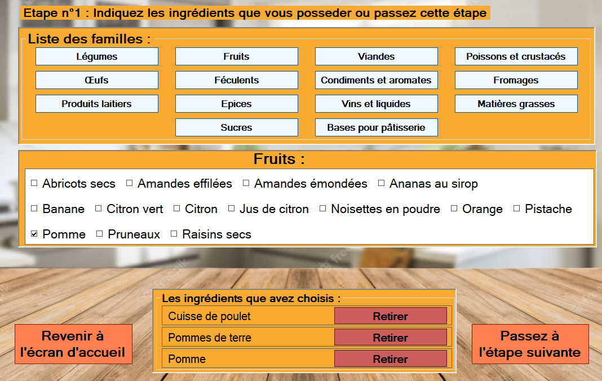

Sur cet écran, l'utilisateur peut choisir 3 ingrédients maximum dans différentes catégories d'ingrédients.
Il peut aussi ne choisir aucun ingrédient s'il veut tous les ingrédients.

#### Filtre de recherche (Ecran 2/2)
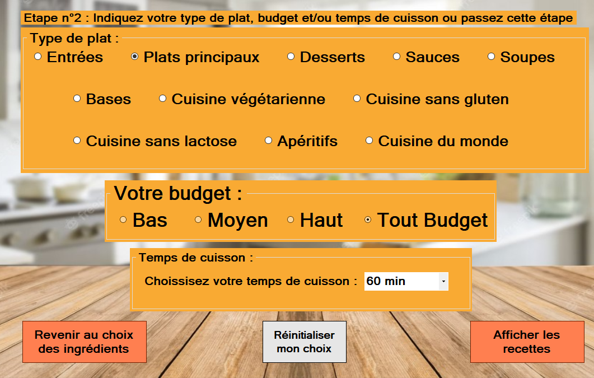

Sur ce 2ème écran de filtre, l'utilisateur peut choisir le type de plat, le budget qu'il dispose et le temps de cuisson.
Il peut également ne choisir aucun filtre.
Un bouton permet de réinitialiser les filtres.

#### Résultats de la recherche
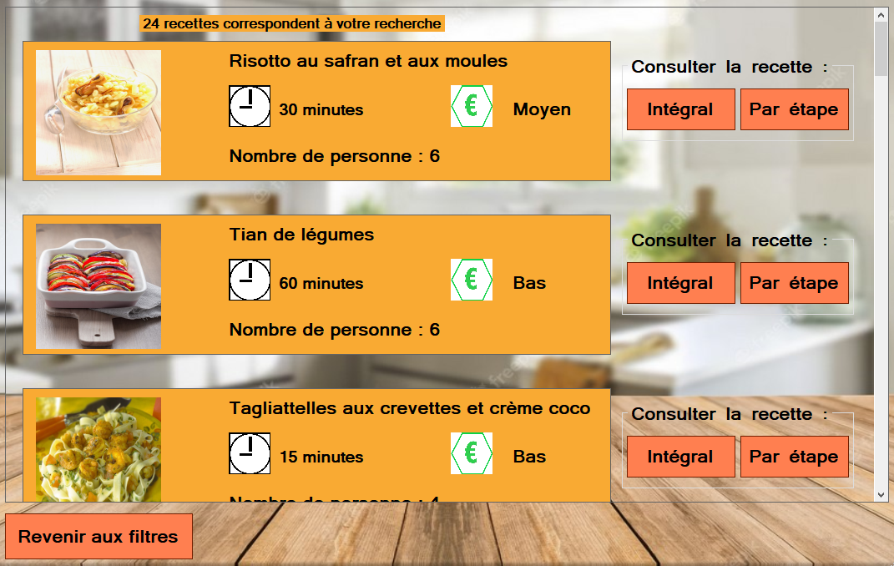

Cet écran affiche les recettes qui correspondent à la recherche en fonction des filtres choisis.
Chaque recette peut être consultée en mode intégral ou en étape par étape.

#### Recette intégrale
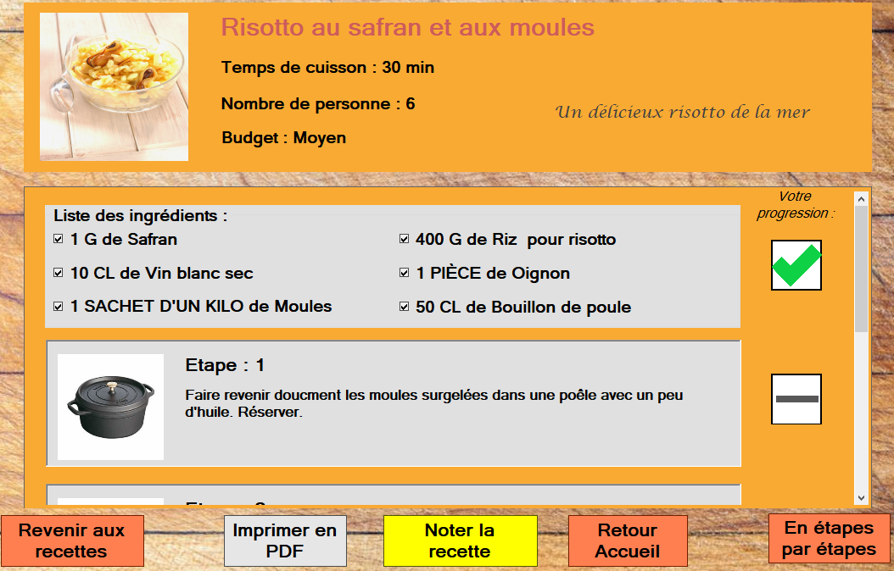

Cet écran affiche la recette de manière intégrale avec en premier la liste des ingrédients et ensuite chaque étape de la recette.
Des cases peuvent être cochées pour savoir la progession dans la réalisation de la recette.

Depuis cet écran, l'utilisateur a la possbilité de passer en mode étape par étape, revenir à l'écran d'acceuil ou de noter la recette.

Un bouton permet également d'imprimer la recette en PDF.
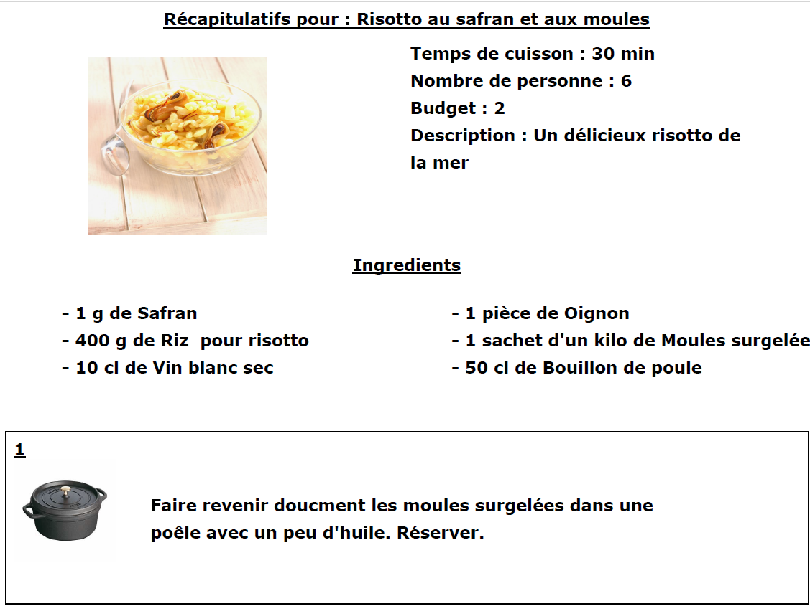

#### Recette étape par étape
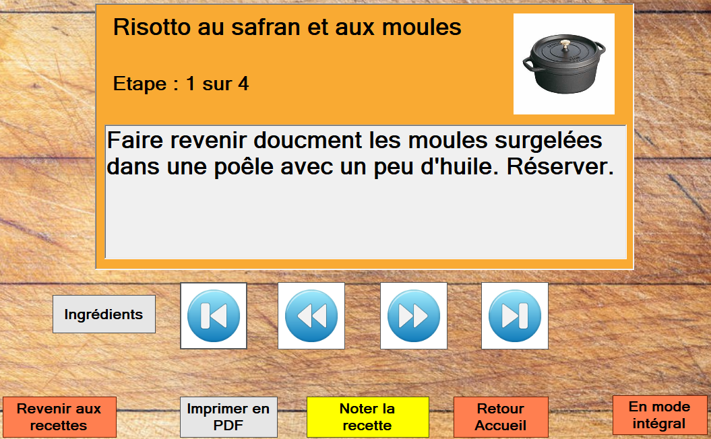

Cet écran permet de consulter la recette étape par étape. La navigation entre chaque étape se fait grâce aux 4 boutons de flèches bleues et blanches. On peut avancer ou reculer d'une étape et on peut se rendre directement à la 1ère ou à la dernière étape.
Les boutons du bas sont les mêmes que ceux de l'affichage en mode intégral avec la possibilité de passer en mode intégral.

#### Notations
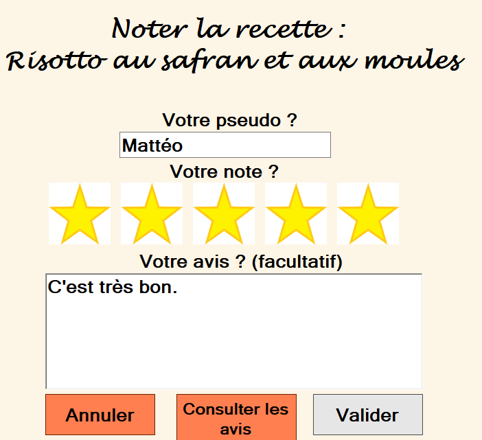

Cet écran permet de noter une recette.
L'utilisateur entre son pseudo, entre une note (entre 1 et 5 étoiles) et peut entrer un commentaire.

#### Consultation des avis
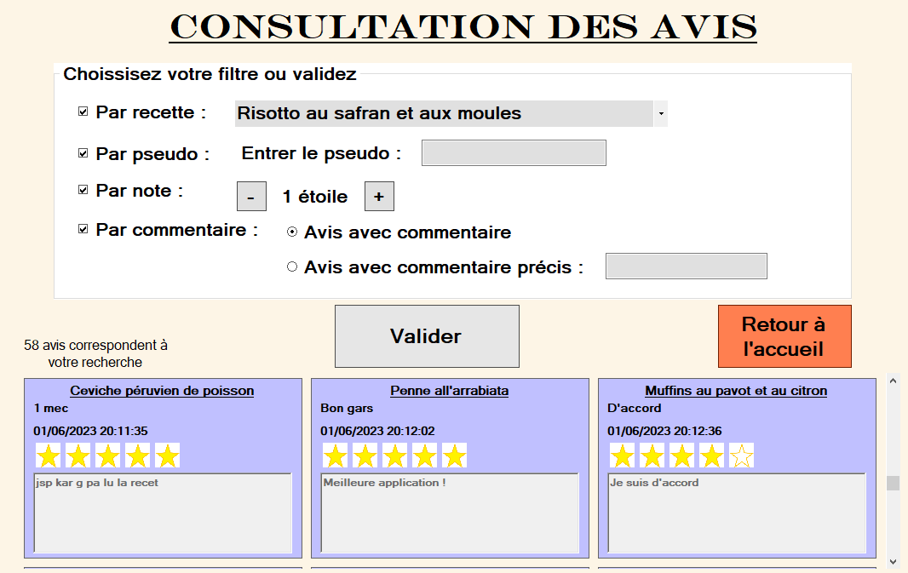
Cet écran permet de consulter les avis. L'utilisateur peut choisir des filtres pour trier les avis ou peut ne choisir aucun filtre pour afficher tous les avis.

## Installation

### Prérequis
Prérequis : assurer d'avoir Visual Studio 2022 d'installé pour pouvoir compiler l'application et générer un exécutable

Vous pouvez installer VisualStudio 2022 Community depuis le site de Microsoft : https://visualstudio.microsoft.com/fr/downloads/

#### Téléchargement

Télécharger en ZIP ou cloner le projet.

Si vous télécharger le ZIP : 
- Avant de dézipper, faites clique droit et ouvrer les `Propriétés` et débloquer le dossier et faites OK
- Extraire le dossier

Si vous cloner :
```
git clone git@github.com:matteorenaud/FaitMaison.git
```

Puis, ouvrer le fichier `Projet_A21D21_RENAUD_Mattéo_GILLIG_Mattéo_TP4.sln` avec VisualStudio 2022

Une fois le projet ouvert :
- Aller dans l'onglet `Générer`, puis `Générer la solution`
- Ouvrez ensuite la fichier frmAccueil.cs
    - Si vous êtes dans la partie Design, faites Clique droit puis `Afficher le code`
    - Ou alors, dans l'`Explorateur de solution`, déployer `frmAccueil.Designer.cs`, puis déployer `frmAccueil` et double cliquer sur `frmAccueil()`

    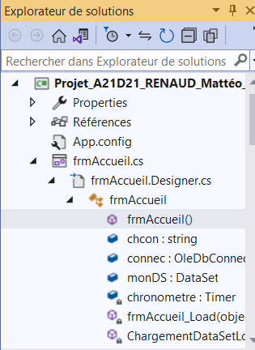

Puis, modifier le chemin de la chaîne de connexion de la base de données : 
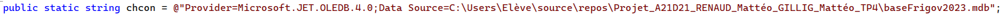
Par, le chemin vers la base de données sur votre ordinteur :
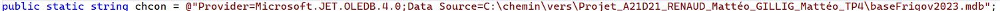

Vous pouvez maintenant recompiler et lancer l'application !

Un fichier exécutable a été généré dans `/bin/debug/Projet_A21D21_RENAUD_Mattéo_GILLIG_Mattéo_TP4.exe`
Vous pouvez créer un raccourcis de cet exécutable et le placer sur votre bureau.

Vous pouvez maintenant profiter de l'application !

#### En cas d'erreurs

##### Chaîne de connexion
Si vous avez fait une erreur dans la chaîne de connexion, le message suivant s'affiche et l'application plantera suite à une _System.NullReferenceException_.

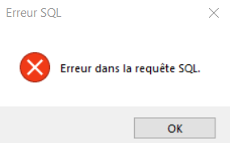

##### Erreur provider

##### Erreur
Si quand vous lancer l'application depuis l'IDE, vous obtenez cette erreur
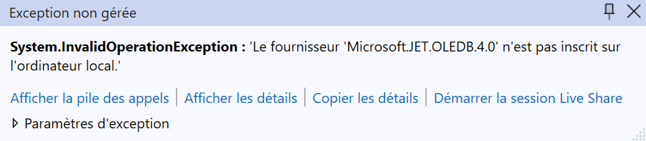

Ou depuis l'exécuable (si vous avez générer la solution) :

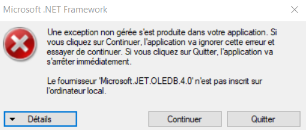

##### Solution

Faites Clique droit sur `Projet_A21D21_RENAUD_Mattéo_GILLIG_Mattéo_TP4` dans l'explorateur de solution
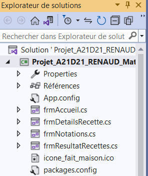

Puis, aller dans les `Propriétés`

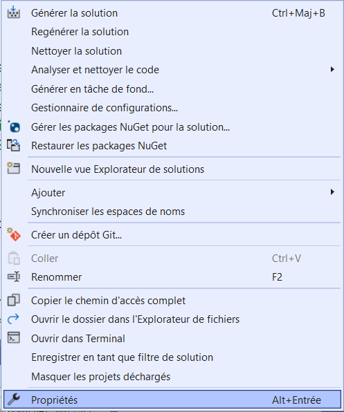

Puis, dans la catégrie `Build` et cocher ou décocher `Préferer 32 bits`

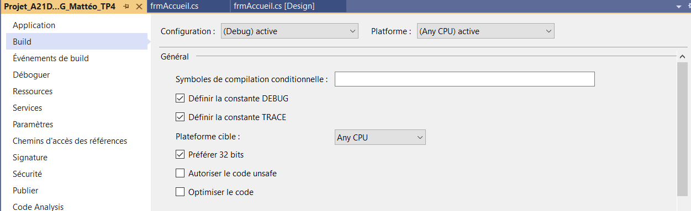

### Informations utile :
- Package NuGet : PDFSharp (1.50.5147)
- Base de données : .mdb
    - Schéma de la base de données (ce n'est pas un MCD)
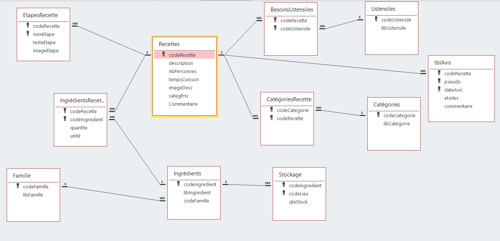
- Une petite bibliothèque de UserControls a été réalisé pour ce projet (Bibliothèque_UserControl_ProjetA21D21_RENAUD_Mattéo_GILLIG_Mattéo_TP4.dll)